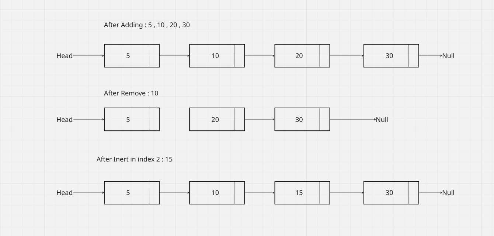
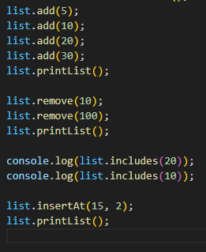
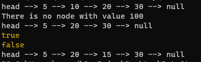
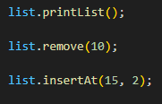
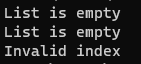

# Singly Linked List Implementation in JavaScript

## Problem Domain

This implementation provides a complete singly linked list data structure with the following core operations:

- **Add a node at the end**
- **Remove a node by value**
- **Print the list**
- **Check if a value exists**
- **Insert a node at a specific index**


## Implementation

### Node Class

```javascript
class Node {
    constructor(data) {
        this.data = data;
        this.next = null;
    }
}
```

### LinkedList Class

```javascript
class LinkedList {
    constructor() {
        this.head = null;
        this.length = 0;
    }

    /**
     * Adds a new node with the given value at the end of the list
     * Time Complexity: O(n) - traverses to the end
     * Space Complexity: O(1) - creates one new node
     */
    add(data) {
        const newNode = new Node(data);
        
        if (!this.head) {
            this.head = newNode;
        } else {
            let current = this.head;
            while (current.next) {
                current = current.next;
            }
            current.next = newNode;
        }
        this.length++;
    }

    /**
     * Removes the first node with the specified value
     * Time Complexity: O(n) - worst case traverses entire list
     * Space Complexity: O(1) - uses constant extra space
     */
    remove(data) {
        if (!this.head) {
            console.log("List is empty");
            return false;
        }

        // If head node contains the value to remove
        if (this.head.data === data) {
            this.head = this.head.next;
            this.length--;
            return true;
        }

        let current = this.head;
        while (current.next && current.next.data !== data) {
            current = current.next;
        }

        if (current.next) {
            current.next = current.next.next;
            this.length--;
            return true;
        }

        console.log(`Value ${data} not found in the list`);
        return false;
    }

    /**
     * Prints all values in the list
     * Time Complexity: O(n) - visits each node once
     * Space Complexity: O(n) - stores values in array for output
     */
    printList() {
        if (!this.head) {
            console.log("List is empty");
            return;
        }

        const values = [];
        let current = this.head;
        
        while (current) {
            values.push(current.data);
            current = current.next;
        }
        
        console.log(values.join(" -> ") + " -> null");
    }

    /**
     * Checks if a value exists in the list
     * Time Complexity: O(n) - worst case traverses entire list
     * Space Complexity: O(1) - uses constant extra space
     */
    includes(data) {
        let current = this.head;
        
        while (current) {
            if (current.data === data) {
                return true;
            }
            current = current.next;
        }
        
        return false;
    }

    /**
     * Inserts a new node at the specified index
     * Time Complexity: O(n) - traverses to the index position
     * Space Complexity: O(1) - creates one new node
     */
    insertAt(data, index) {
        if (index < 0 || index > this.length) {
            console.log("Invalid index");
            return false;
        }

        if (index === 0) {
            const newNode = new Node(data);
            newNode.next = this.head;
            this.head = newNode;
            this.length++;
            return true;
        }

        const newNode = new Node(data);
        let current = this.head;
        
        for (let i = 0; i < index - 1; i++) {
            current = current.next;
        }
        
        newNode.next = current.next;
        current.next = newNode;
        this.length++;
        return true;
    }

    
}
```

## Algorithm Descriptions

### 1. Add a Value
1. Create a new node with the given value
2. If the list is empty, make the new node the head
3. Otherwise, traverse from the head until reaching the last node
4. Link the last node to the new node
5. Increment the list length

### 2. Remove a Value
1. Check if the list is empty; if so, report and exit
2. If the head node contains the target value, update head pointer and decrement length
3. Otherwise, traverse the list to find a node whose next node contains the target value
4. Bypass the target node by linking the current node directly to the node after the target
5. If the value is not found, report that it doesn't exist

### 3. Check if Value Exists (Includes)
1. Start from the head of the list
2. Traverse each node sequentially
3. If any node contains the target value, return true
4. If the end is reached without finding the value, return false

### 4. Insert at Specific Index
1. Validate the index (must be between 0 and list length)
2. Create a new node with the given value
3. If index is 0, set the new node as head and connect to the old head
4. Otherwise, traverse to the position just before the target index
5. Insert the new node by updating the link connections
6. Increment the list length

### 5. Print the List
1. Check if the list is empty; if so, print "List is empty"
2. Start from the head node
3. Collect each node's value while traversing
4. Continue until the last node, then output all values with "null" at the end

## Time and Space Complexity Analysis

| Operation | Time Complexity | Space Complexity | Description |
|-----------|----------------|------------------|-------------|
| `add(data)` | O(n) | O(1) | Traverses to end of list |
| `remove(data)` | O(n) | O(1) | Worst case traverses entire list |
| `printList()` | O(n) | O(n) | Visits each node, stores values for output |
| `includes(data)` | O(n) | O(1) | Worst case traverses entire list |
| `insertAt(data, index)` | O(n) | O(1) | Traverses to specified index |
| **Overall Space** | - | **O(n)** | Stores n nodes in memory |


## Visual Representation



---
## Inputs and Expected outputs :

## Inputs :




## outputs :



--- 

## Edge Cases :

## Inputs :



## outputs :




