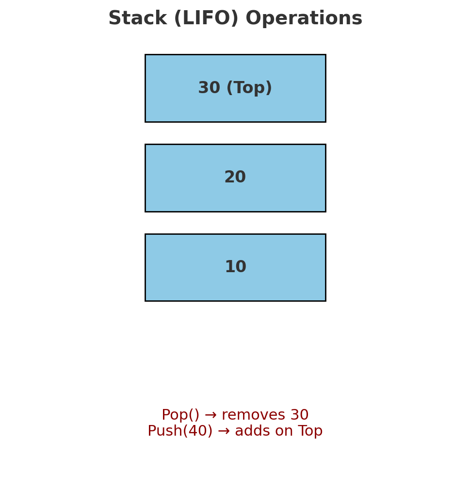
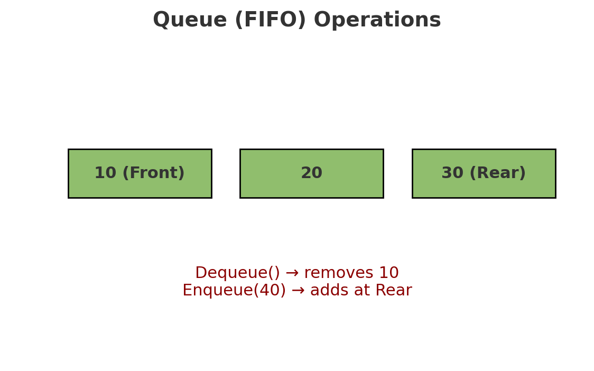

# Stack and Queue Data Structures

## 📌 Problem Domain

Implement two basic data structures:

* **Stack (LIFO)**: Last In, First Out
* **Queue (FIFO)**: First In, First Out

Each data structure should support core operations such as adding, removing, peeking, and checking if empty.

---

## 📥 Inputs and Expected Outputs

### Stack

* `push(10) →` Stack: Top → 10
* `push(20) →` Stack: Top → 20 → 10
* `pop() → 20` (removes top)
* `peek() → 10` (returns top without removing)
* `isEmpty() → true/false`

### Queue

* `enqueue(10) →` Queue: Front → 10
* `enqueue(20) →` Queue: Front → 10 → 20
* `dequeue() → 10` (removes front)
* `peek() → 20` (returns front without removing)
* `isEmpty() → true/false`

---

## ⚠️ Edge Cases

* **Stack**

  * Popping/peeking from an empty stack should return a clear message.
  * Handling multiple pops until empty.
* **Queue**

  * Dequeuing/peeking from an empty queue should return a clear message.
  * Ensure rear is updated to `null` when the last node is removed.

---

## 🎨 Visual

### Stack (LIFO)

```
Push(10) → Push(20) → Push(30)

Top → [30] → [20] → [10]

Pop() → returns 30
```

### Queue (FIFO)

```
Enqueue(10) → Enqueue(20) → Enqueue(30)

Front → [10] → [20] → [30] ← Rear

Dequeue() → returns 10
```

---

## ⚙️ Algorithm

### Stack

1. **Push**: Create a new node, point it to current top, update top.
2. **Pop**: Remove top, update pointer to next node.
3. **Peek**: Return top value if exists.
4. **isEmpty**: Return true if top is null.

### Queue

1. **Enqueue**: Create a new node, add it at the rear.
2. **Dequeue**: Remove front, update pointer to next node.
3. **Peek**: Return front value if exists.
4. **isEmpty**: Return true if front is null.

---

## 💻 Real Code

Code is implemented in:

* `Node.js`
* `Stack.js`
* `Queue.js`
* `app.js` (demo runner)
* Jest tests: `stack.test.js`, `queue.test.js`

---

## ⏱ Big O Time/Space Complexity

### Stack

* **Push**: O(1)
* **Pop**: O(1)
* **Peek**: O(1)
* **isEmpty**: O(1)
* **Space**: O(n) (n = number of nodes)

### Queue

* **Enqueue**: O(1)
* **Dequeue**: O(1)
* **Peek**: O(1)
* **isEmpty**: O(1)
* **Space**: O(n)

---

## 🎨 Visual

### Stack (LIFO)


### Queue (FIFO)
