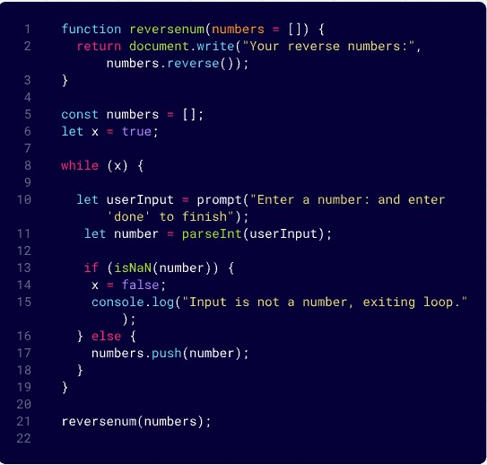
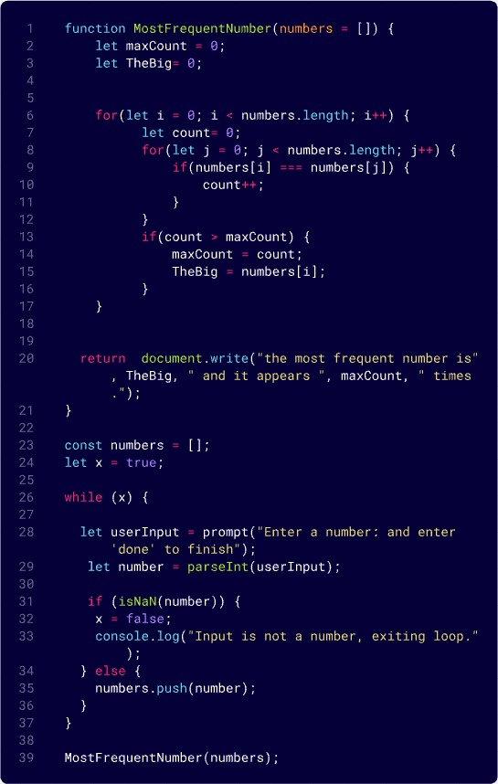
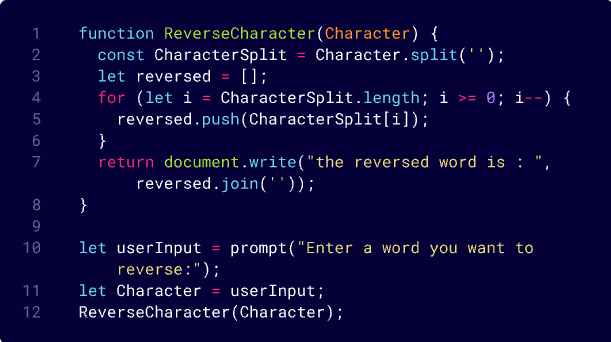

# 🧩 Challenge: Array Reversal

## 📝 Description
Create a function called `ArrayReversal` that takes an array as an input and returns a **new array with the elements in reverse order**. The twist: **you are not allowed to use any built-in methods** such as `reverse()`.

---

## 📸 Whiteboard Image with Code

---
# 🔢 Challenge: Most Frequent Number

## 📝 Description
Write a method that takes an array of integers and returns the **number that appears the most times**.

---

## 📸 Whiteboard Image with Code

---
# 🔢 Challenge: Minimum Value

## 📝 Description
Write a method that takes an array of integers and returns the **Minimum Value In The Array**.

---

## 📸 Whiteboard Image with Code

---

# 🧩 Challenge: Reverse Character

## 📝 Description
Write a function called `ReverseCharacters` that takes a single string as input. Without using any built-in methods, The function should return the string with all characters reversed. The twist: **you are not allowed to use any built-in methods** such as `reverse()`.

---

## 📸 Whiteboard Image with Code :

