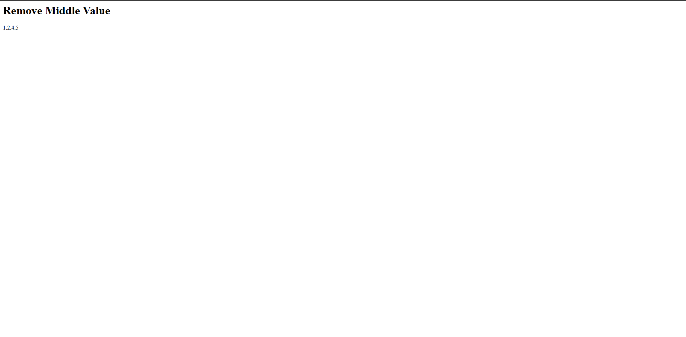
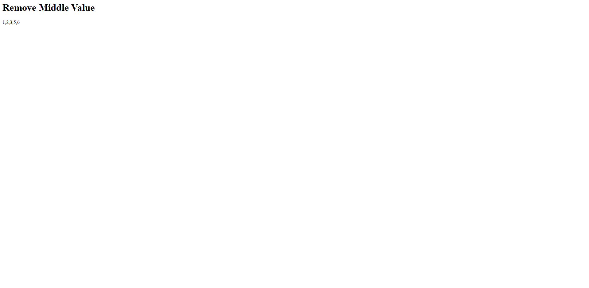

# 🧩 Challenge: Remove Middle Value

## 📝 Description

Write a function called **RemoveMiddleValue** that takes in an array as its parameter. Without utilizing any of the built-in methods available in the language, the function should remove the value at the middle index of the array. The function should then return the modified array.

---

## 📸 Input Image

---

## 📸 output Image if the length of array is odd

`1,2,3,4,5`

---

## 📸 output Image if the length of array is even

`1,2,3,4,5,6`

